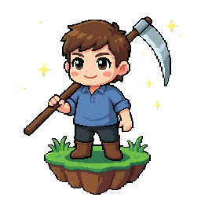

<p align="center">
  
</p>

<h1 align="center">Voidmower</h1>

A tiny **Godot 4** 3D prototype: a blocky kid with a scythe mows grass on a
floating island in space. Everything is built procedurally in GDScript — no
assets to import.

## Run

```sh
./play.sh    # play
./edit.sh    # open in the editor
```

Auto-detects Godot; override with `GODOT=/path/to/godot ./play.sh`.

## Controls

- **WASD / Arrows** — move & turn
- **Space** — swing the scythe
